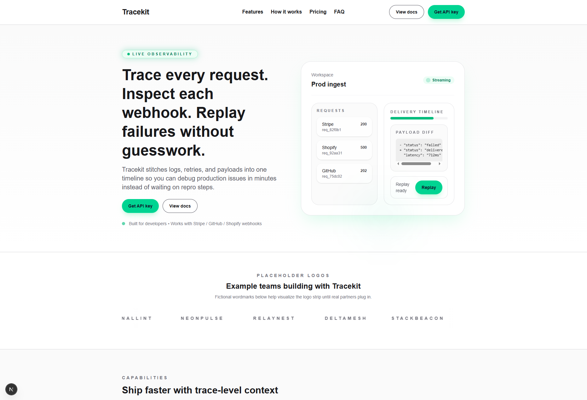

# Tracekit Landing Page

> Portfolio build showcasing premium marketing-site craft for a developer observability product.



This repo contains a single-page experience designed to demonstrate:

- strong visual hierarchy and brand polish,
- modular, data-driven sections,
- attention to accessibility and keyboard flows, and
- production-ready Next.js/Tailwind patterns you can trust for client work.

---

## Overview

| Section | Highlights |
| ------- | ---------- |
| Header / Hero | Sticky nav with mobile overlay, CTA pair, animated “live observability” preview |
| Social Proof | Auto-scrolling placeholder logos (fictional) to show layout potential |
| Features & Flow | Typed content model powering cards and timeline |
| Code Snippet | Accessible copy-to-clipboard interaction with feedback state |
| Pricing & FAQ | Responsive card grid, accordion with keyboard support |
| Footer | Three-column structure with product/company links and portfolio note |

All content lives in `src/content/site.ts`, making it easy to swap real data in when a client is ready.

---

## Tech Stack & Tooling

- **Next.js 15 App Router** (TypeScript, RSC-first)
- **Tailwind CSS 4** with custom utility layer
- Reusable UI primitives (`Button`, `Container`) to keep layout consistent
- Typed content modules for navigation, features, pricing, FAQ, footer, and placeholder logos
- Zero third-party UI dependencies to keep bundle lean

---

## Running Locally

```bash
# 1. Install
npm install

# 2. Start dev server (Turbopack ready)
npm run dev

# 3. Quality checks
npm run lint
npm run build
```

Requirements: **Node.js 18+**

---

## Project Structure

```
app/
  layout.tsx        # Metadata + font config (Geist)
  page.tsx          # Section composition only
src/
  components/
    sections/       # Header, Hero, SocialProof, Features, etc.
    ui/             # Button, Container primitives
  content/site.ts   # Typed marketing copy + placeholder logos/footer links
  lib/cn.ts         # Classname helper
public/
  landing_page.png  # Screenshot preview
docs/
  STEP_*.md         # Build notes per milestone
```

---

## Quality Checklist

- [x] Responsive review @ 375 / 768 / 1280 (Chrome dev tools)
- [x] Keyboard navigation + focus states verified
- [x] `npm run lint`
- [x] `npm run build`
- [x] No console errors in dev/build

---

## Opportunities for Clients

Want to reuse this foundation for your product?

- Swap in real logos/content via `src/content/site.ts`
- Hook CTAs to live docs or onboarding flows
- Extend sections (e.g., testimonials, long-form blog) without refactoring core layout

Questions or collaboration ideas? Reach out via the contact links in the footer. I’m happy to adapt this build to your brand or craft something new.
